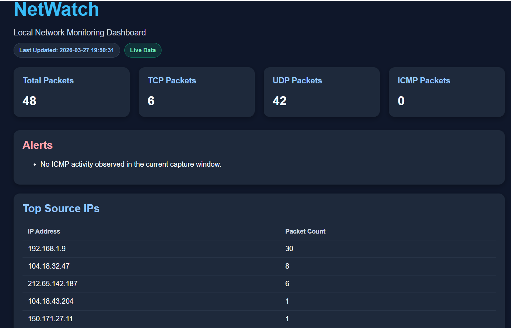
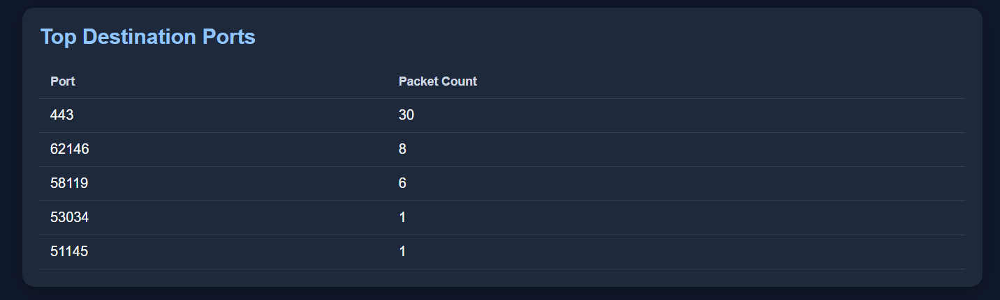
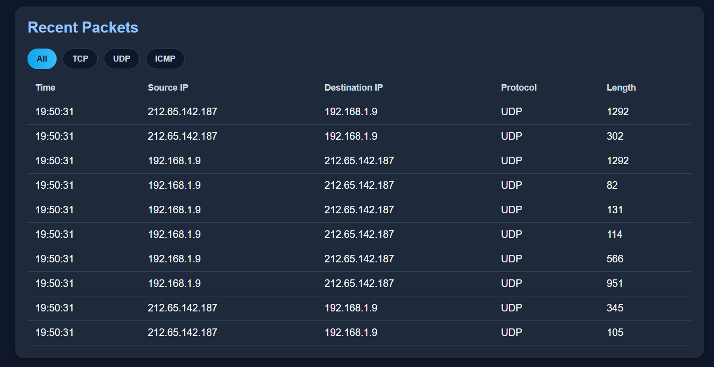

# NetWatch  
### Local Network Monitoring Dashboard

NetWatch, **yerel ağ trafiğini analiz etmek ve modern bir web arayüzünde göstermek** için geliştirilen bir ağ izleme dashboard projesidir.  
Proje; ağ paketlerini yakalar, protokollere göre sınıflandırır, önemli trafik özetlerini çıkarır ve bunları kullanıcıya sade ama güçlü bir panel üzerinden sunar.

> Bu proje Python, Flask ve Scapy kullanılarak geliştirilmiştir.

---

## Project Highlights

- Live packet capture desteği
- TCP, UDP ve ICMP paket sayılarının analizi
- En aktif kaynak IP adreslerinin listelenmesi
- En çok kullanılan hedef portların gösterimi
- Son paketlerin tablo halinde sunulması
- Protokole göre filtreleme desteği
- Trafik dağılımının görsel olarak gösterilmesi
- Live data çalışmazsa sample data fallback desteği
- Modern ve koyu tema dashboard tasarımı

---

## Screenshots

### Main Dashboard
Ana panelde toplam paket sayısı, protokol bazlı özetler, canlı veri durumu, uyarılar ve en aktif kaynak IP bilgileri gösterilir.



### Traffic Details
Bu bölümde en çok kullanılan hedef portlar ve son yakalanan paketler tablo halinde sunulur.



### Protocol Distribution
Bu bölüm, ağ trafiğinin TCP / UDP / ICMP dağılımını görsel olarak özetler.



---

## Features

### 1. Packet Monitoring
NetWatch, ağ arayüzünden gelen paketleri yakalayarak temel trafik analizini gerçekleştirir.

### 2. Protocol Analysis
Yakalanan veriler TCP, UDP ve ICMP olarak ayrıştırılır ve protokol bazlı istatistikler oluşturulur.

### 3. Top Source IP Detection
En aktif kaynak IP adresleri listelenerek ağdaki yoğun trafik noktaları görünür hale getirilir.

### 4. Destination Port Analysis
En çok kullanılan hedef portlar analiz edilerek trafik eğilimleri ortaya çıkarılır.

### 5. Recent Packet Table
Son yakalanan paketler; zaman, kaynak IP, hedef IP, protokol ve uzunluk bilgileriyle listelenir.

### 6. Protocol Filtering
Kullanıcı paketleri protokole göre filtreleyebilir: **All, TCP, UDP, ICMP**

### 7. Fallback Support
Canlı paket yakalama mümkün olmadığında sistem sample data ile çalışmaya devam eder.

---

## Technologies Used

- **Python**
- **Flask**
- **Scapy**
- **HTML**
- **CSS**
- **JavaScript**

---

## Project Structure

```text
app.py
sniffer.py
detector.py
logger.py
templates/
static/
görseller/
requirements.txt
README.md
