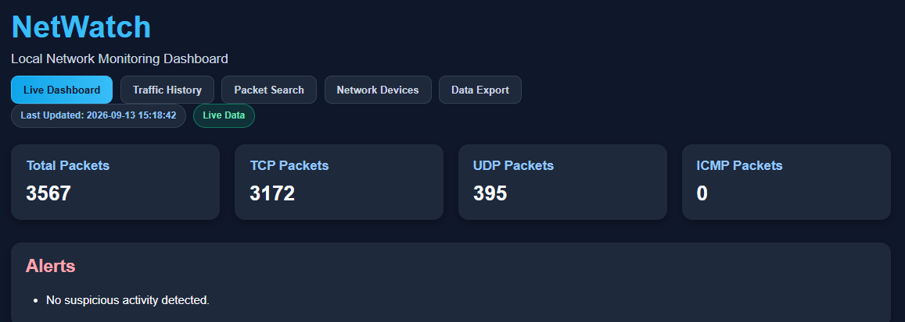
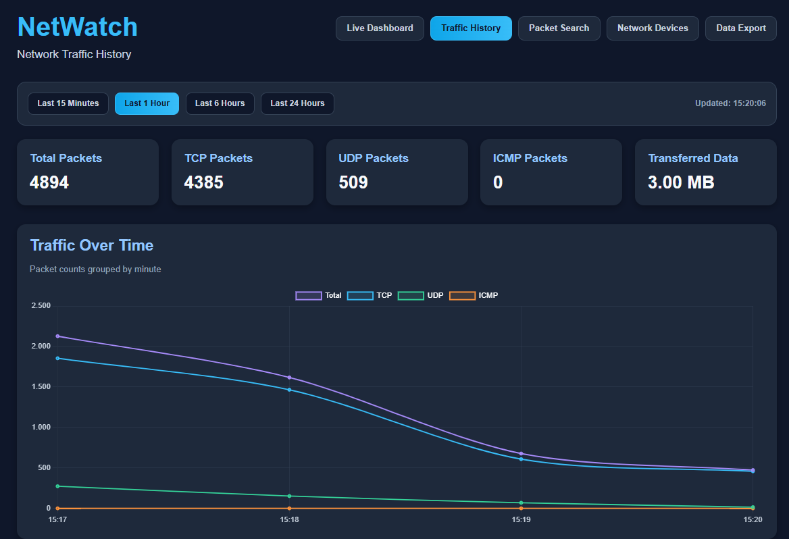
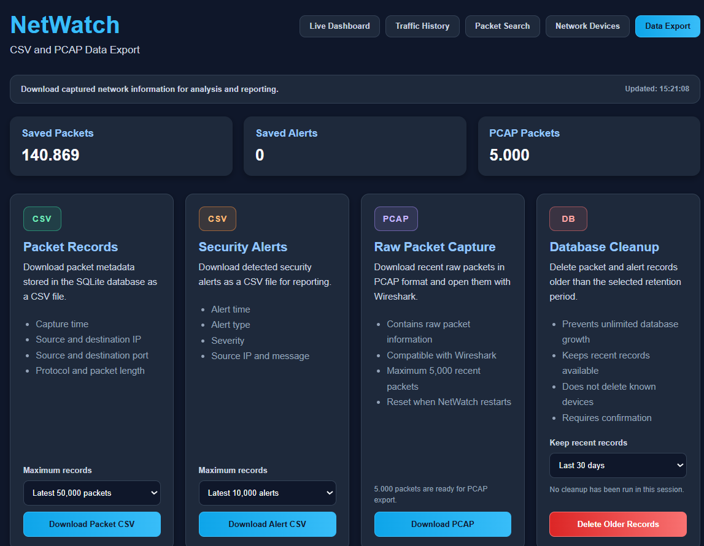
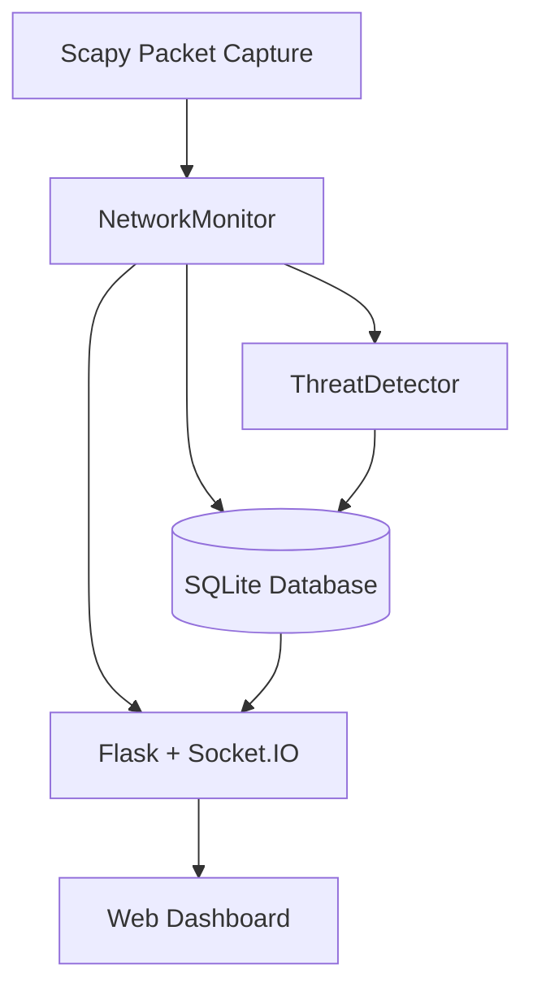

<div align="center">

# 🛡️ NetWatch

### Real-Time Local Network Monitoring & Threat Detection Dashboard

NetWatch captures local network traffic, analyzes packet metadata, detects suspicious activity, and presents the results through a modern web dashboard.

<br>


</div>

---

## 📖 About

NetWatch is a local network monitoring and lightweight threat detection application developed with Python, Flask, Scapy, Socket.IO, and SQLite.

The application captures packets visible to the computer, processes their metadata, stores historical records, and updates the dashboard in real time. It also includes traffic history, advanced packet search, local device discovery, security alerts, CSV/PCAP export, and database retention management.

If live packet capture cannot be started, NetWatch automatically switches to sample data mode so that the dashboard can still be explored.

> NetWatch is designed for educational, cybersecurity learning, and portfolio purposes. It is not intended to replace a production-grade IDS or SIEM platform.

---

## ✨ Key Features

| Feature | Description |
|---|---|
| 📡 Live Packet Capture | Captures local network packets with Scapy |
| ⚡ Real-Time Dashboard | Sends updated traffic information using Flask-SocketIO |
| 📊 Protocol Statistics | Displays TCP, UDP, ICMP, and total packet counts |
| 🕒 Traffic History | Shows traffic changes over 15 minutes, 1 hour, 6 hours, or 24 hours |
| 🔍 Advanced Search | Filters packets by IP address, protocol, port, and time range |
| 🖥️ Device Discovery | Tracks detected local devices, IP addresses, and MAC addresses |
| 🚨 Threat Detection | Detects port scans, SYN floods, ICMP floods, and high DNS traffic |
| 💾 SQLite Storage | Stores packet metadata, alerts, and detected devices |
| 📤 Data Export | Exports packet and alert records as CSV and recent raw packets as PCAP |
| 🧹 Database Cleanup | Deletes packet and alert records older than the selected retention period |
| 🧪 Automated Tests | Includes 9 tests for routes, database operations, detection rules, and monitoring |
| 📴 Offline Assets | Uses local Chart.js and Socket.IO files without depending on a CDN |
| 🧾 Rotating Logs | Saves application events in size-limited rotating log files |
| 🧪 Sample Mode | Provides demonstration data when live capture is unavailable |

---

## 🖼️ Dashboard Preview

### Live Traffic Overview



### Destination Port Analysis



### Recent Packet Records



---

## 🧭 Application Pages

| Page | Route | Purpose |
|---|---|---|
| Live Dashboard | `/` | Displays current traffic, alerts, top IPs, ports, and recent packets |
| Traffic History | `/history` | Visualizes historical network traffic using interactive charts |
| Packet Search | `/search` | Searches stored packet records using advanced filters |
| Network Devices | `/devices` | Lists devices detected from local network traffic |
| Data Export | `/exports` | Downloads CSV/PCAP files and manages database retention |

---

## 🏗️ System Architecture


```mermaid
flowchart TD
    A["Scapy Packet Capture"] --> B["NetworkMonitor"]
    B --> C["ThreatDetector"]
    B --> D[("SQLite Database")]
    C --> D
    B --> E["Flask + Socket.IO"]
    D --> E
    E --> F["Web Dashboard"]
```

### How It Works

1. Scapy captures packets visible to the active network interface.
2. `NetworkMonitor` extracts packet metadata and updates live statistics.
3. `ThreatDetector` checks the traffic against rule-based detection thresholds.
4. Packet metadata, alerts, and device information are stored in SQLite.
5. Flask provides pages and JSON API endpoints.
6. Flask-SocketIO sends live summary updates to the dashboard.
7. Chart.js displays historical traffic data in the browser.

---

## 🚨 Detection Rules

NetWatch uses lightweight rule-based detection:

| Detection | Rule |
|---|---|
| Port Scan | 15 different destination ports within 10 seconds |
| SYN Flood | 100 SYN packets within 5 seconds |
| ICMP Flood | 50 ICMP packets within 10 seconds |
| High DNS Traffic | 100 DNS packets within 10 seconds |
| Alert Cooldown | Prevents the same alert from repeating for 30 seconds |

These thresholds can be adjusted in `detector.py`.

---

## 💾 Data Management

NetWatch stores the following information in SQLite:

- Packet capture time
- Source and destination IP addresses
- Source and destination ports
- Network protocol
- Packet length
- Security alerts
- Detected device information
- First-seen and last-seen timestamps

Packet records are written in batches to reduce unnecessary database operations.

The cleanup feature can retain the latest:

- 7 days
- 30 days
- 90 days
- 365 days

Device records are not removed during packet and alert cleanup.

---

## 📤 Export Options

### Packet CSV

Exports up to 50,000 packet metadata records.

### Security Alert CSV

Exports up to 10,000 detected security alerts.

### PCAP

Exports up to 5,000 recent raw packets captured during the current NetWatch session. PCAP files can be opened with tools such as Wireshark.

---

## 🛠️ Technologies

| Technology | Usage |
|---|---|
| Python | Core application language |
| Flask | Web application and API routes |
| Flask-SocketIO | Real-time dashboard updates |
| Scapy | Network packet capture and analysis |
| SQLite | Local data storage |
| HTML | Dashboard structure |
| CSS | Responsive dark interface |
| JavaScript | Dynamic tables, filtering, API requests, and live updates |
| Chart.js | Historical traffic visualization |
| unittest | Automated application testing |

---

## 📁 Project Structure

```text
Netwatch/
├── app.py
├── database.py
├── detector.py
├── device_manager.py
├── export_manager.py
├── logger.py
├── packet_search.py
├── sniffer.py
├── requirements.txt
│
├── data/
│   └── netwatch.db
│
├── images/
│   ├── netwatch1.png
│   ├── netwatch2.png
│   └── netwatch3.png
│
├── static/
│   ├── style.css
│   └── vendor/
│       ├── chart.umd.min.js
│       ├── socket.io.min.js
│       ├── LICENSE-chart.js.md
│       └── LICENSE-socket.io-client.txt
│
├── templates/
│   ├── _navigation.html
│   ├── index.html
│   ├── history.html
│   ├── search.html
│   ├── devices.html
│   └── exports.html
│
└── tests/
    ├── test_app.py
    ├── test_database.py
    ├── test_detector.py
    └── test_sniffer.py
```

The database, logs, cache files, virtual environment, and generated PCAP files are excluded from Git.

---

## 🚀 Installation

### 1. Clone the Repository

```bash
git clone https://github.com/betulaltunyuva/Netwatch.git
cd Netwatch
```

### 2. Create a Virtual Environment

```bash
python -m venv venv
```

### 3. Activate the Virtual Environment

#### Windows PowerShell

```powershell
.\venv\Scripts\Activate.ps1
```

#### Windows Command Prompt

```cmd
venv\Scripts\activate
```

#### Linux or macOS

```bash
source venv/bin/activate
```

### 4. Install Dependencies

```bash
pip install -r requirements.txt
```

### 5. Start NetWatch

```bash
python app.py
```

### 6. Open the Dashboard

Open the following address in your browser:

```text
http://127.0.0.1:5000
```

---

## 🪟 Windows Packet Capture

Live packet capture may require:

- Running VS Code or the terminal as Administrator
- Installing a compatible packet capture driver such as Npcap
- Allowing Python through the firewall when requested

If packet capture cannot start, NetWatch automatically switches to sample data mode.

---

## 🧪 Running Tests

Run all automated tests with:

```bash
python -m unittest discover -s tests -v
```

Expected result:

```text
Ran 9 tests

OK
```

The tests cover:

- Flask pages and JSON endpoints
- Security response headers
- Database cleanup
- Packet search and CSV export
- Device tracking
- Port scan detection
- Flood detection rules
- Sample data mode
- Batch database writes

---

## 🔐 Security and Privacy

- The application listens only on `127.0.0.1` by default.
- Socket.IO connections are restricted to local application addresses.
- A random secret key is generated when an environment key is not provided.
- Basic browser security headers are enabled.
- Packet metadata is stored locally in SQLite.
- Recent raw packets are kept in memory for session-based PCAP export.
- Log files use rotation to prevent unlimited log growth.

For a fixed application secret, set the `NETWATCH_SECRET_KEY` environment variable before starting the application.

---

## ⚠️ Limitations

- NetWatch can only analyze traffic visible to the computer and selected network interface.
- Administrator or root permissions may be required for live packet capture.
- Encrypted traffic payloads are not decrypted.
- Threat detection is rule-based and may produce false positives or miss advanced attacks.
- Raw packets used for PCAP export are cleared when the application restarts.
- The application is intended for local use and educational environments.

---

## 🔮 Possible Future Improvements

- Network interface selection
- IPv6 device discovery improvements
- Configurable threat detection thresholds
- Authentication and user roles
- Email or desktop alert notifications
- Docker support
- Additional protocol analysis
- Continuous integration testing
- More advanced anomaly detection

---

## 👩‍💻 Author

**Betül Altunyuva**

Software Engineering Student

[GitHub Profile](https://github.com/betulaltunyuva)

---

<div align="center">

Developed for learning, network analysis, and cybersecurity practice.

⭐ If you find the project useful, consider giving it a star.

</div>
